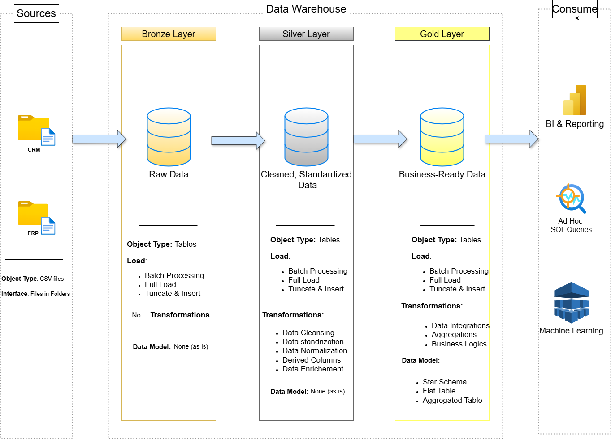

# 🏗️ Data Warehouse Project – Layered Architecture

This project demonstrates the creation of a **modern data warehouse** using a layered architecture: **Bronze**, **Silver**, and **Gold** layers. The goal is to collect raw data, clean and transform it, and prepare it for advanced analytics such as **BI dashboards**, **SQL-based exploration**, and **machine learning**.

## 📊 Architecture Overview

The architecture follows a **medallion model** (Bronze → Silver → Gold), as shown below:

### 🔶 Bronze Layer – Raw Data
- **Source**: CSV files from systems like CRM and ERP.
- **Content**: Raw, unprocessed data.
- **Load Type**: Batch processing, full load (truncate and insert).
- **Transformations**: None.
- **Data Model**: As-is (no schema applied).

### 🔘 Silver Layer – Cleaned & Standardized Data
- **Transformations**:
  - Data cleansing
  - Standardization
  - Normalization
  - Derived columns
  - Enrichment
- **Load Type**: Full load with overwrite strategy.
- **Data Model**: Still flexible (no enforced schema yet).

### 🟡 Gold Layer – Business-Ready Data
- **Transformations**:
  - Business logic
  - Data integrations
  - Aggregations
- **Use Cases**:
  - BI tools (Power BI, Tableau)
  - Ad-hoc SQL queries
  - Machine learning pipelines
- **Data Model**: Structured (Star schema, flat or aggregated tables).

## 🚀 Outcome
This layered approach ensures scalable, maintainable, and analytics-friendly data pipelines that turn raw input into valuable insights for various teams.

